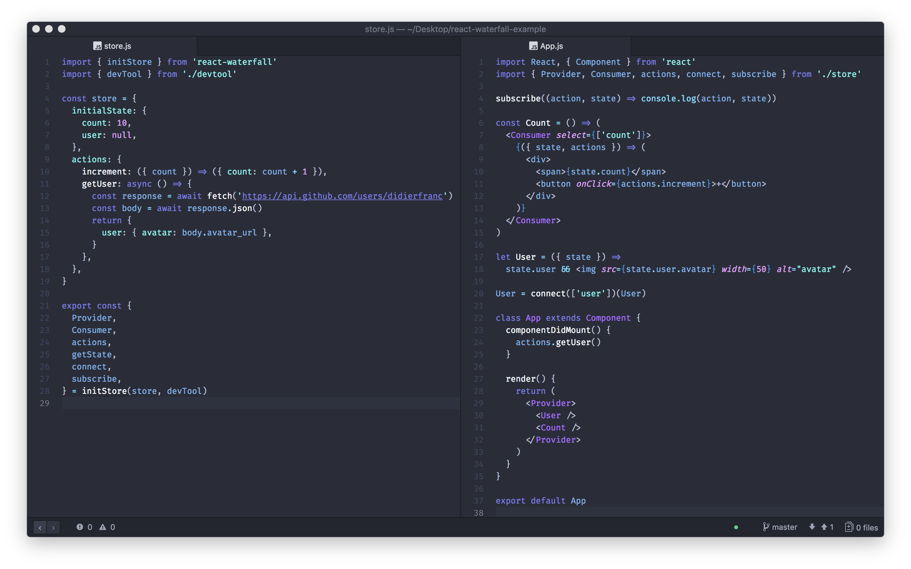

# react-stateful

## How to use it ?

```sh
yarn add https://github.com/didierfranc/react-stateful.git
```

Here is an example of the simplest implementation.

```js
import { initStore } from 'react-stateful'

const store = {
  initialState: { count: 0 },
  actions: {
    increment: ({ count }) => ({ count: count + 1 }),
  },
}

const { Provider, connect } = initStore(store)

let Count = ({ state, actions }) => (
  <>
    {state.count}
    <button onClick={actions.increment}>+</button>
  </>
)

Count = connect(['count'])(Count)

const App = () => (
  <Provider>
    <Count />
  </Provider>
)
```

## Types

You can explore types [here](dist/react-stateful.js.flow)

## Advanced

Advanced examples are available [here](https://github.com/didierfranc/react-stateful-example)



## Links

* https://twitter.com/DidierFranc/status/965733433711489024
* https://medium.com/@DidierFranc/replacing-redux-with-the-new-react-context-api-8f5d01a00e8c
